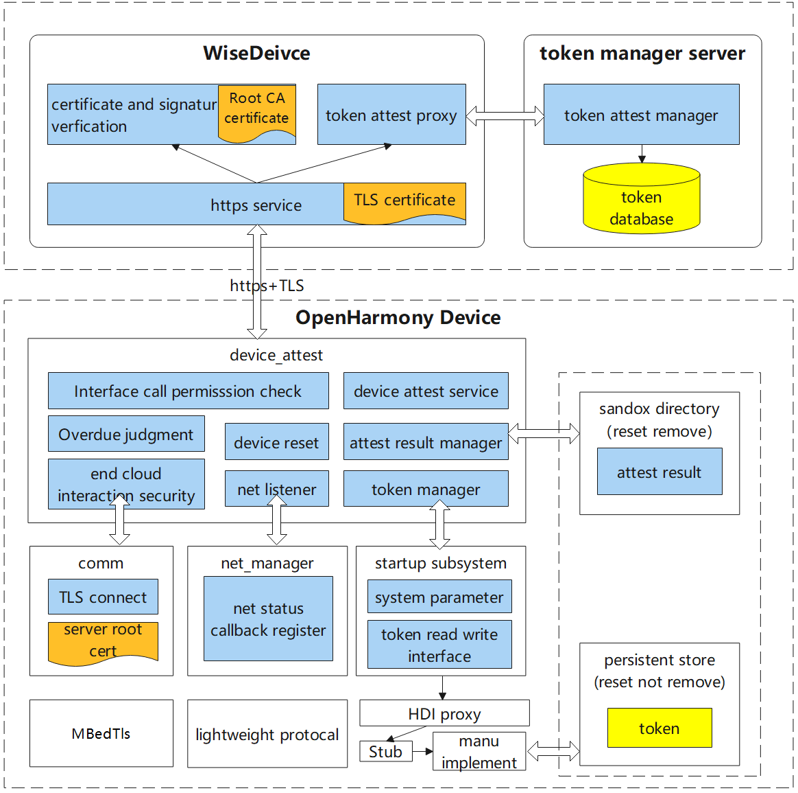
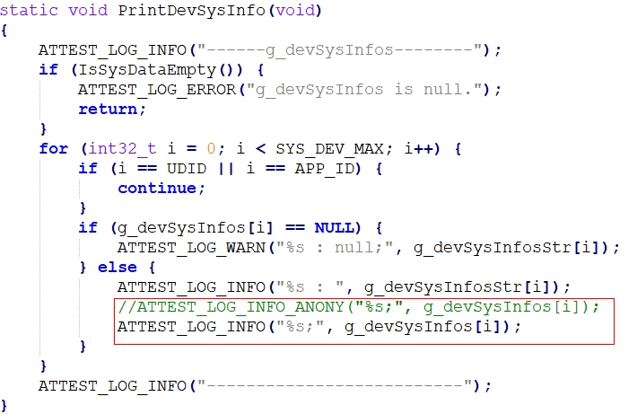
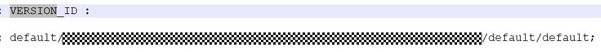
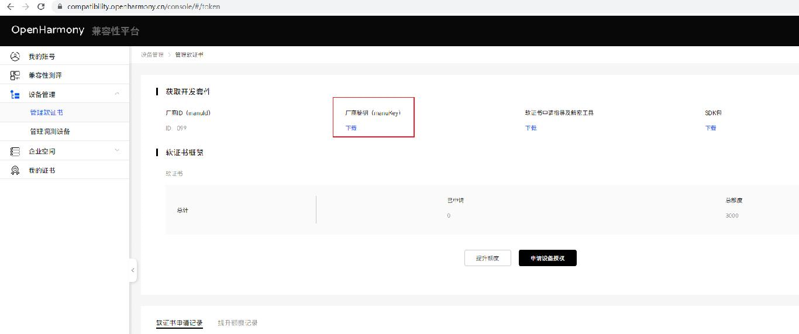
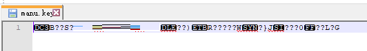
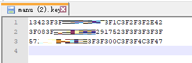
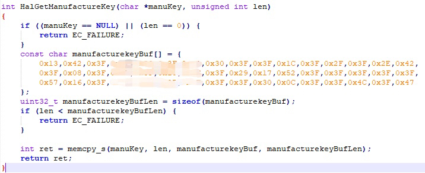
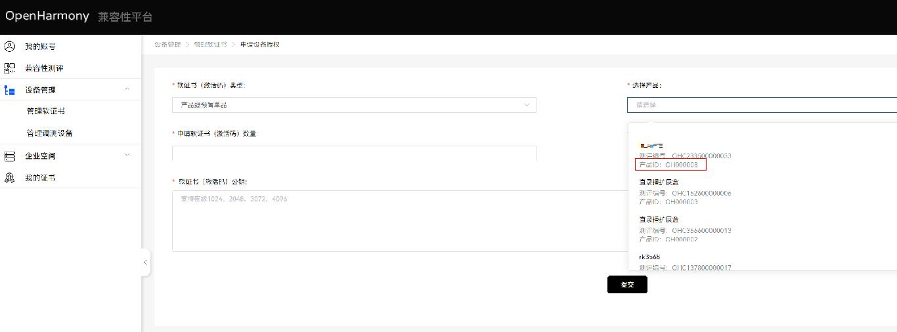
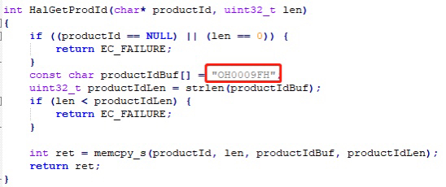

# device_attest_lite module<a name="EN-CN_TOPIC_001"></a>

-   [Introduction](#section100)
-   [Directory Structure](#section200)
-   [Architecture diagram](#section300)
-   [Constraints](#section400)
-   [Integration guidance](#section500)
    -   [Terminology](#section501)
    -   [Partner completes information registration](#section502)
    -   [Dependent interface adaptation](#section503)
    -   [External interface](#section504)
    -   [Compilation instruction](#section505)  
-   [Repositories Involved](#section600)


## Introduction<a id="section100"></a>

xts_device_attest module：

-   The basic function of the xts_device_attest module is to take care of the OpenHarmony ecological device attest results, and achieve the goal of counting the number of OH ecological devices through the cloud of end data. The purpose is to count the number of OH equipment. xts_device_attest module applies to standard system.

## Directory Structure<a id="section200"></a>

```
/test/xts
├── device_attest               
│   └── build                   # Compile configuration
│   └── common                  # Public basic capacity
│   └── figures                
│   └── interfaces              # External interface
│   └── sample                  # External interface example
│   └── services                # Service subject and business logic code
│       └── core                # Business logic code
│       └── devattest_ability   # Service framework
│       └── etc                 # Startup configuration
│       └── sa_profile          # Process configuration
│   └── test           
│       └── unittest            # Test case
```

## Architecture diagram<a id="section300"></a>



## Constraints<a id="section400"></a>

The integration dependency library is shown in the following table:：

| Library    | Version           | Function description                                        | Note                                     |
| --------- | ---------------- | ----------------------------------------------- | ---------------------------------------- |
| mbedtls   | 2.16.11          | A lightweight implementation library of TLS protocol for embedded devices. | Library path..\third_party\mbedtls           |
| OpenSSL   | 1.1.1          | TLS protocal（include SSLv3）and common password library. | Library path..\third_party\openssl           |
| cJSON     | 1.7.15           | JSON file resolution library.                               | Library path..\third_party\cJSON\third_party |
| libsec    | 1.1.10           | Security function library.                                    | Library path..\bounds_checking_function      |
| parameter | OpenHarmony 1.0+ | System interface for obtaining device information.                        | Library path ..\base\startup\init\interfaces\innerkits\include\syspara\parameter.                    |


## Integration guidance<a id="section500"></a>

### Terminology<a id="section501"></a>

**table 1** 
**table 1** 
| Term       | Explain                                                         |
| ---------- | ------------------------------------------------------------ |
| partners       | Enterprises applying for OpenHarmony compatibility evaluation are hereinafter collectively referred to as "partners". It is required to integrate xts_device_attest module. |
| manuKey    | The secret key obtained by partners from the official website of the [OpenHarmony compatibility platform](https://openatom.cn/atomavatar/#/login?redirect=%2Fauthorize%3Fresponse_type%3Dcode%26client_id%3D6bdacef0a8bd11ec938bd9550d2decfd%26redirect_uri%3Dhttps%3A%2F%2Fcompatibility.openharmony.cn%2Fconsole%26appName%3DOpenHarmony%E8%AE%A4%E8%AF%81%E5%B9%B3%E5%8F%B0%26scope%3D0,1,2,3%26state%3D%2Fpersonal). It is used to encrypt and protect relevant data in the product. To ensure the compatibility of multiple products, manuKey should remain unchanged during the life cycle of all products. |
| productId  | When a partner applies for compatibility evaluation from the official website of the OpenHarmony compatibility platform, the platform assigns a unique product identifier to the evaluation product. The productId must remain unchanged throughout the product life cycle. |
| productKey | When partners apply for compatibility evaluation from the official website of the OpenHarmony compatibility platform, the platform assigns the unique product secret key to the evaluation product. It corresponds to the productId one by one, and is used to encrypt and protect product level data. It is also necessary to ensure that it remains unchanged throughout the product life cycle. |
| token     | The partner obtains the device credentials allocated by the platform from the official website of the OpenHarmony compatibility platform, one for each device, to identify the device identity. It needs to be stored in the security partition, and cannot be cleared when the factory settings are restored or the image is upgraded. |


### Partner completes information registration <a id="section502"></a>

Partners need to register a series of basic information about product equipment on the [OpenHarmony compatibility platform](https://openatom.cn/atomavatar/#/login?redirect=%2Fauthorize%3Fresponse_type%3Dcode%26client_id%3D6bdacef0a8bd11ec938bd9550d2decfd%26redirect_uri%3Dhttps%3A%2F%2Fcompatibility.openharmony.cn%2Fconsole%26appName%3DOpenHarmony%E8%AE%A4%E8%AF%81%E5%B9%B3%E5%8F%B0%26scope%3D0,1,2,3%26state%3D%2Fpersonal), such as 公司简称（英文）, 品牌英文名称, 设备型号, etc.
In the equipment certification processing process, the equipment certification module reads the equipment information and reports it to the foundation cloud, which verifies it. Therefore, partners are required to complete product information registration on the official website of the OpenHarmony compatibility platform in advance, including the following two steps:
  
1）Partners complete device information registration on the official website of OpenHarmony compatibility platform.  
2）Partners write the device information registered on the official website of the OpenHarmony compatibility platform to the device.


1.  Partners complete information registration on the OpenHarmony compatibility platform

    Partners need to register relevant equipment certification data on the OpenHarmony compatibility platform, please follow the registration process on the official website.

2.  Partners writes the registered OS information to the device

    For the information registered by partners on the OpenHarmony compatibility platform, the version package provides relevant interfaces for partners to fill in.
    When calling the xts_device_attest function, the value filled in by the partner will be reported to the foundation cloud, which will compare and verify the information registered in the previous section with the information reported by the device.
    xts_device_attest module depends on some device information and needs to be adapted and modified by partners.  
    Device information is located in the startup subsystem file: base/startup/init/services/etc/param/ohos_const/ohos.para.The device OS information is shown in the following table：

**table 2** 
| Device information         | ohos.para configuration parameter                                           | Note                         |
| --------------- | ------------------------------------------------------------ | ---------------------------- |
| 发布类型         | const.ohos.releasetype=Beta                                 | Use default    |
| api版本          | const.ohos.apiversion=6                                     | Use default    |
| 安全补丁标签     | const.ohos.version.security_patch=2021-09-01                | 2021-09-01 replace with real value   |
| 软件版本号       | const.ohos.fullname=OpenHarmony-1.0.1.0                      | Use default |
  
Device product information is located in the vendor subsystem file: base/startup/init/services/etc/param/ohos.para. The device product information is shown in the following table：

**table 3** 
| Device information         | vendor.para configuration parameter                                | Note                         | 
| ---------------- | ------------------------------------------------- | ---------------------------- |
| 企业简称（英文）  | const.product.manufacturer=****                  | **** replace with real value |
| 品牌英文名        | const.product.brand=****                         | **** replace with real value |
| 设备型号         | const.product.model=****                            | **** replace with real value    |
| 软件版本号       | \# const.product.software.version="OpenHarmony 1.0.1"    const.product.software.version=OpenHarmony 3.3.3.3 | "OpenHarmony 1.0.1"  replace with real value |
| 版本 id          |                                                     | No partner operation is required, and the system automatically generates |
| 版本 Hash        | const.ohos.buildroothash=default                    | 添加该数据 defaultreplace with real value|

Note：版本 id needs to be obtained through equipment，Fill in the OpenHarmony compatibility platform，版本 id consists of：
VersionId = deviceType/manufacture/brand/productSeries/OSFullName/productModel/softwareModel/OHOS_SDK_API_VERSION/incrementalVersion/buildType

Get 版本 id:   
    1) OS information and product information writing device  
    2) Release encrypted log(Modify the modification of PrintDevSysInfo in the following figure)  
    3) Burn  
    4) View 版本 ID through logs   

 

View 版本 ID through logs 

 


### Dependent interface adaptation <a id="section503"></a>

In order to shield the differences in the underlying implementations of different modules, vendor defines token related APIs, which are implemented by partners through adaptation. The interface definitions are shown in the following table：

**table 4** 
| 
Function                                            | Interface definition                                                   | Parameters definition                                                     | Return value                | Belong to                  |
| ----------------------------------------------- | ---------------------------------------------------------- | ------------------------------------------------------------ | --------------------- | ------------------------- |
| Read manuKey                                    | int32_t HalGetManufactureKey(char\* manuKey, uint32_t len) | acKey：Secret key storage memory len：memory length                          | 0：success      -1：fail | ..\hal_token.h |
| Read ProductId                                  | int32_t HalGetProdId(char\* productId, uint32_t len)    | productId：Product model identification len：memory length                     | 0：success      1：fail    | ..\hal_token.h |
| Read token                                     | int32_t HalReadToken(char\* token, uint32_t len);          | token：Token storage memory len：memory length                 | 0：success      1：fail   | ..\hal_token.h |
| Write token                                      | int32_t HalWriteToken(char\* token, uint32_t len);         | token：Token storage memory len：memory length                 | 0：success      1：fail    | ..\hal_token.h |
|Read ProductKey（Reserved interface） | int32_t HalGetProdKey(char\* productKey, uint32_t len)  | productKey：Product (Unique) Secret Key len：memory length | 0：success      1：fail  | ..\hal_token.h |


    1. HalGetManufactureKey  
    manuKey is a parameter used to generate AES secret key in combination with the token, which is downloaded from the OpenHarmony compatibility platform.  



    Convert ASCII code to hexadecimal through tools.  
  


  

    
    Preset in the return value of HalGetManufactureKey interface.  



    2. HalGetProdId  
    ProductId is a parameter that is used to generate AES secret key together with the token, which can be viewed on the OpenHarmony platform.  



    Preset in the return value of HalGetProductId interface



    3. HalReadToken 和 HalWriteToken
    The manufacturer needs to implement the token read and write interface, write the token in the security partition of the device, and the partition will not be erased when the device is restarted or initialized.

    4. HalGetProdKey  
    Reserved interface, which does not need to be implemented temporarily.


### External interface<a id="section504"></a>

xts_device_attest module external interface，the following table:

| **Interface Name**                                              | **Description**     |
| ------------------------------------------------------- | ------------ |
| int32_t  GetAttestStatus(AttestResultInfo* attestResultInfo); | Get attest result |

The service of xts_device_attest starts automatically when device is started. After the network connection is successful, it will enter the process of xts_device_attest. By querying the GetAttestStatus interface, you can get the results of device attest.
Call to view sample example.

### Compilation instruction<a id="section505"></a>

Take rk3568 as an example
```c
./build.sh --product-name=rk3568 system_size=standard
```

## Repositories Involved<a id="section600"></a>

**xts\_device\_attest**

[xts\_device\_attest\_lite](https://gitee.com/openharmony-sig/xts_device_attest_lite/)